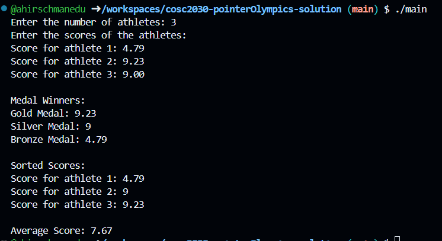

# Pointer Olympics
Welcome to the Olympic Event Scoring System! Your challenge is to design a program that not only manages and analyzes athletes' scores but also awards medals to the top performers. 

## Here's your event (task) lineup: 
- **Dynamic Allocation Ceremony:** Write a program that dynamically allocates an array to hold the scores of a user-defined number of Olympic athletes. This will ensure we have just the right amount of space for all competitors' scores.
- **Sorting Sprint:** After all scores have been entered, pass the array to a function that sorts these scores in ascending order. This will help us rank the athletes from the lowest to the highest score. **Your function must use a selection sort algorithm.**
- **Average Achievement:** Once the scores are sorted, call another function to calculate the average score of all athletes. This will provide insight into the average performance level across the event.
- **Medal Ceremony:** After calculating the average, award the medals! Create a function to print out which athletes receive Gold, Silver, and Bronze medals based on their scores. The top three performers will receive medals in descending order of their scores.
- **Display of Results:** Finally, your program should display the sorted list of scores, the average score, and the medal winners with clear headings. **Use pointer notation rather than array notation** wherever possible to complete the task.

## Breakdown of tasks: 
- Allocate an array based on user input.
- Sort the array in ascending order.
- Calculate the average score.
- Award Gold, Silver, and Bronze medals.
- Print the sorted scores, average score, and medal winners with appropriate headings.

## Requirements for grading: 
After completing your code, run it with test data and take a screenshot of your output in the terminal. 
**Save and upload this screenshot to this GitHub repository.**

# Example output: 
